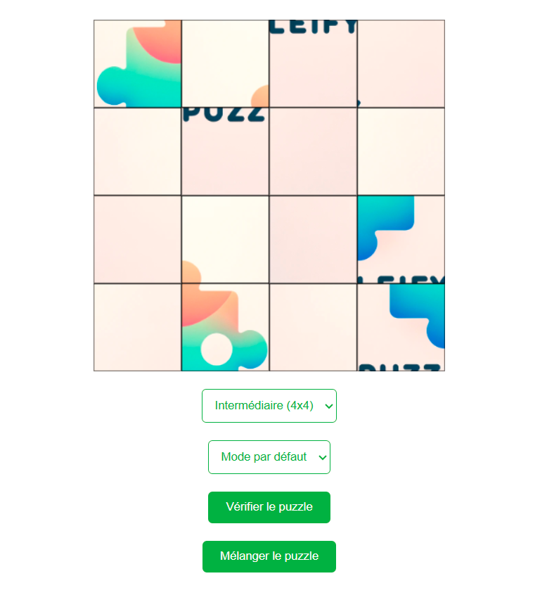
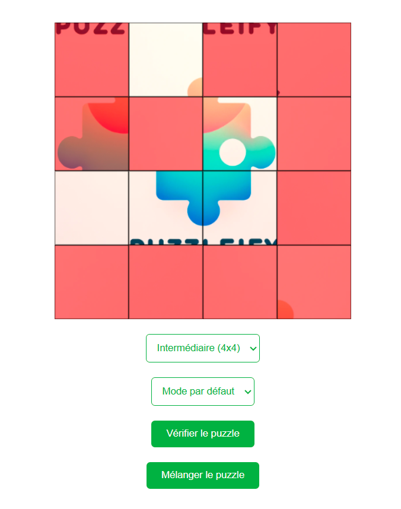
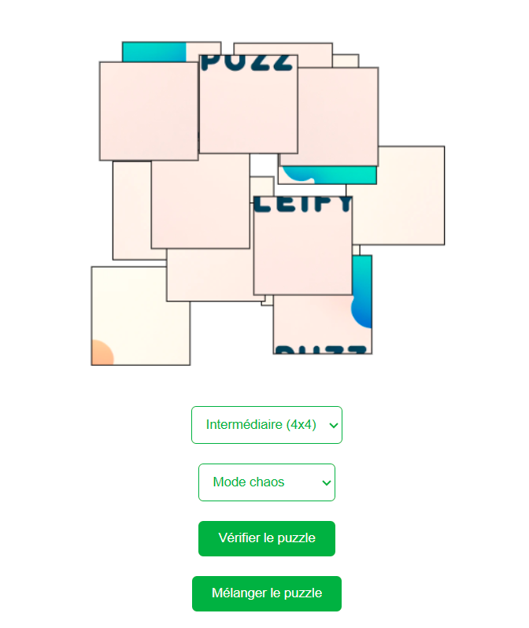

# Puzzleify
[NPM](https://www.npmjs.com/package/puzzleify)

Puzzleify lets you create a puzzle of different sizes from an imported image.

### Two game modes are available :
- The classic : allows you to swap pieces between them.
- The chaos : the pieces are placed at random on the board.
  **Warning: in chaos mode, the pieces can be superimposed on each other, this is chaos !**


## Installation

Install puzzleify with npm

```bash
  npm install puzzleify
```

## Exemple how to use with React

```js
import React, { useEffect, useRef } from 'react';
import logo from './logo.png';
import { initializePuzzles, attachCheckButtonEvents, attachShuffleButtonEvents  } from "puzzleify";
import './App.css';

function App() {
  const imageRef = useRef(null);

  useEffect(() => {
    initializePuzzles();
    attachCheckButtonEvents();
    attachShuffleButtonEvents();
  }, []);

  const handleDifficultyChange = (e) => {
    const difficulty = e.target.value;
    const canvas = document.querySelector("[data-puzzle-canvas='true']");
    if(canvas) {
        canvas.parentNode.replaceChild(imageRef.current, canvas);
    }
    if(imageRef.current) {
        imageRef.current.setAttribute('data-puzzle', difficulty);
    }
    initializePuzzles();
  }

  const handleModeChange = (e) => {
    const mode = e.target.value;
    const canvas = document.querySelector("[data-puzzle-canvas='true']");
    if(canvas) {
        canvas.parentNode.replaceChild(imageRef.current, canvas);
    }
    if(imageRef.current) {
      imageRef.current.setAttribute('data-mode-puzzle', mode);
    }
    initializePuzzles();
  }


  return (
    <div className="App">
      <header className="App-header">
        

        <select onChange={handleDifficultyChange}>
          <option value="2">Facile (2x2)</option>
          <option value="4" selected>Intermédiaire (4x4)</option>
          <option value="6">Difficile (6x6)</option>
        </select>

        <select onChange={handleModeChange}>
          <option value="default" selected>Mode par défaut</option>
          <option value="chaos">Mode chaos</option>
        </select>

        <button data-puzzle-check>Vérifier le puzzle</button>
        <button data-puzzle-shuffle>Mélanger le puzzle</button>

      </header>
    </div>
  );
}

export default App;
```
## Screenshots





## Authors

- [Yoann Chambeux](https://github.com/Yoann-CH)
- [Théo Landa](https://github.com/slorochi)
- [Axel Blanchard](https://www.github.com/imxale)
